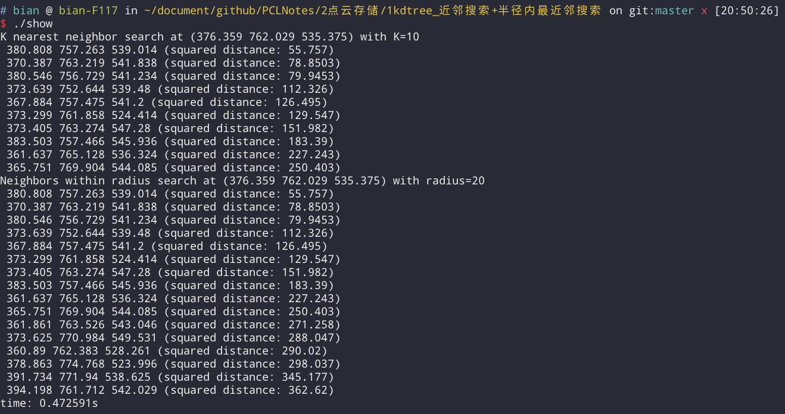

#  kdtree 近邻搜索

virtual int pcl::KdTree< PointT >::nearestKSearch  ( const PointT &  p_q,  
                                                        int  k,  
                                                        std::vector< int > &  k_indices,  
                                                        std::vector< float > &  k_sqr_distances  
                                                    )
    搜索给定查询点的k个近邻.
    Parameters:
        [in] 给定查询点
        [in] 要搜索的近邻点个数k  
        [out] 相邻点的结果索引
        [out] 到相邻点的最终平方距离
    Returns:
        找到的近邻点数量

