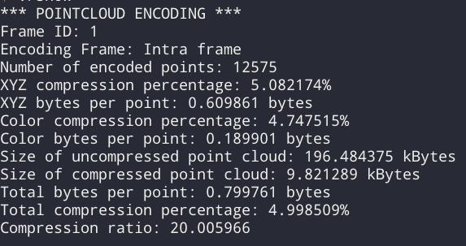

# 八叉树空间分割进行点分布区域的压缩

通过**对连续帧之间的数据相关分析**，**检测出重复的点云**，并将其去除掉再进行传输。点云由庞大的数据集组成，这些数据集通过距离、颜色、法线等附加信息来描述空间三维点。此外，点云能以非常高的速率被创建出来，因此需要占用相当大的存储资源，一但点云需要存储或者通过速率受限制的通信信道进行传输，提供针对这种数据的压缩方法就变得十分有用。PCL库提供了点云压缩功能，它允许编码压缩所有类型的点云，包括“无序”点云，它具有无参考点和变化的点尺寸、分辨率、分布密度和点顺序等结构特征。而且，底层的octree数据结构允许从几个输入源高效地合并点云数据

**Octree八叉树是一种用于描述三维空间的树状数据结构**

八叉树的每个节点表示一个正方体的体积元素，每个节点有八个子节点，将八个子节点所表示的体积元素加在一起就等于父节点的体积。Octree模型：又称为八叉树模型，若不为空树的话，树中任一节点的子节点恰好只会有八个，或零个，也就是子节点不会有0与8以外的数目。Log8(房间内的所有物品数)的时间内就可找到金币。因此，八叉树就是用在3D空间中的场景管理，可以很快地知道物体在3D场景中的位置，或侦测与其它物体是否有碰撞以及是否在可视范围内。

压缩选项详见 /io/include/pcl/compression/compression_profiles.h
LOW_RES_ONLINE_COMPRESSION_WITHOUT_COLOR:分辨率1cm3，无颜色，快速在线编码
LOW_RES_ONLINE_COMPRESSION_WITH_COLOR:分辨率1cm3，有颜色，快速在线编码
MED_RES_ONLINE_COMPRESSION_WITHOUT_COLOR:分辨率5mm3，无颜色，快速在线编码
MED_RES_ONLINE_COMPRESSION_WITH_COLOR:分辨率5mm3，有颜色，快速在线编码
HIGH_RES_ONLINE_COMPRESSION_WITHOUT_COLOR:分辨率1mm3，无颜色，快速在线编码
HIGH_RES_ONLINE_COMPRESSION_WITH_COLOR:分辨率1mm3，有颜色，快速在线编码
LOW_RES_OFFLINE_COMPRESSION_WITHOUT_COLOR:分辨率1cm3，无颜色，高效离线编码
LOW_RES_OFFLINE_COMPRESSION_WITH_COLOR:分辨率1cm3，有颜色，高效离线编码
MED_RES_OFFLINE_COMPRESSION_WITHOUT_COLOR:分辨率5mm3，无颜色，高效离线编码
MED_RES_OFFLINE_COMPRESSION_WITH_COLOR:分辨率5mm3，有颜色，高效离线编码
HIGH_RES_OFFLINE_COMPRESSION_WITHOUT_COLOR:分辨率5mm3，无颜色，高效离线编码
HIGH_RES_OFFLINE_COMPRESSION_WITH_COLOR:分辨率5mm3，有颜色，高效离线编码
MANUAL_CONFIGURATION允许为高级参数化进行手工配置
