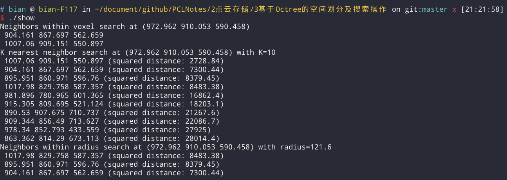

# 基于Octree的空间划分及搜索操作

1. 体素内近邻搜索(Neighbors within Voxel Search)
2. K近邻搜索(K Nearest Neighbor Search)
3. 半径内近邻搜索(Neighbors within Radius Search)

 * pcl::octree::OctreePointCloudSearch  octree
 * octree.voxelSearch
 * octree.nearestKSearch
 * octree.radiusSearch
 * octree是一种用于管理稀疏3D数据的树状数据结构，
 * 每个内部节点都正好有八个子节点，用octree在点云数据中进行空间划分及近邻搜索，
 * 特别地，解释了如何完成
 * “体素内近邻搜索(Neighbors within Voxel Search)”、
 * “K近邻搜索(K Nearest Neighbor Search)”和
 * “半径内近邻搜索(Neighbors within Radius Search)”。