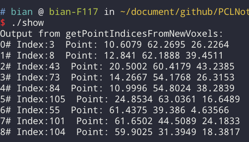

# 无序点云数据集的空间变化检测

**pcl::octree::OctreePointCloudChangeDetector**
octree是一种用于管理稀疏3D数据的树状数据结构，学习如何利用octree实现用于**多个无序点云之间的空间变化检测**，这些点云可能在尺寸、分辨率、密度和点顺序等方面有所差异。通过递归地比较octree的树结构，可以**鉴定出由octree产生的体素组成之间的区别所代表的空间变化**，此外，我们解释了如何使用PCL的octree“双缓冲”技术，以便能实时地探测多个点云之间的空间组成差异。

本实验是为了检索获取存在于couodB的点集R，此R并没有cloudA中的元素，可以调用getPointIndicesFromNewVoxels方法，通过探测两个八叉树之间体素的不同，它返回cloudB 中新加点的索引的向量，通过索引向量可以获取R点集  很明显这样就**探测了cloudB相对于cloudA变化的点集**，但是**只能探测到在cloudA上增加的点集，不能探测减少的**