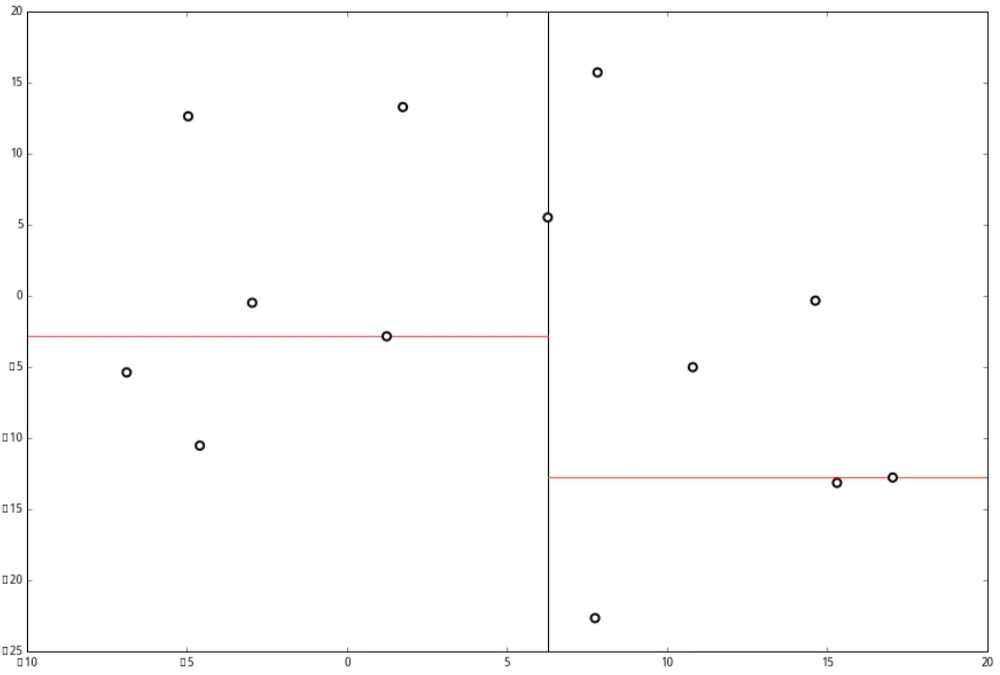

## 点云数据管理

1. 点云压缩
2. 点云索引（KDtree、Octree）
3. 点云LOD（金字塔）
4. 海量点云的渲染

# KDTree

**一种递归的邻近搜索策略**　

kd树（k-dimensional树的简称），是一种**分割k维数据空间的数据结构**。**主要应用于多维空间关键数据的搜索**（如：范围搜索和最近邻搜索）。其实KDTree就是二叉搜索树的变种，这里的K = 3。

**类似与二分查找算法思想**
Kd树按空间划分生成叶子节点，各个叶子节点里存放点数据，其可以**按半径搜索或邻区搜索**。PCL中的Kd tree的基础数据结构使用了FLANN库以便可以快速的进行邻区搜索。

kd树(k-dimension tree)是一种**对k维空间中的实例点进行存储以便对其进行快速检索的树形数据结构**。
kd树是是一种二叉树，表示对k维空间的一个划分，构造kd树相当于不断地用垂直于坐标轴的超平面将K维空间切分，构成一系列的K维超矩形区域。kd树的每个结点对应于一个k维超矩形区域。利用kd树可以省去对大部分数据点的搜索，从而减少搜索的计算量。

**KDTree 解释**
一种数据结构，能快速搜索最近点

**KDTree 实现文字叙述**

1. 选择一个维度（x，y，z ......）
2. 选出这些点这个维度值的中位数
3. 将数据按中位数分为两部分
4. 对这两部分数据同样执行上述操作，直到数据点的数目为 1

**图片描述**

步骤一

步骤二

步骤三

步骤四

步骤五

结果

# OcTree

**一种更容易理解也更自然的策略**

对于一个空间，如果某个角落里有个盒子我们却不知道在哪儿。但是"神"可以告诉我们这个盒子在或者不在某范围内，显而易见的方法就是把空间化成8个卦限，然后询问在哪个卦限内。再将存在的卦限继续化成8个。意思大概就是太极生两仪，两仪生四象，四象生八卦，就这么一直划分下去，最后一定会确定一个非常小的空间。对于点云而言，只要将点云的立方体凸包用octree生成很多很多小的卦限，那么在相邻卦限里的点则为相邻点。

显然，对于不同点云应该采取不同的搜索策略，如果**点云是疏散的**，**分布很广泛**，且**没什么规律**（如**激光雷达**测得的点云或**双目视觉**捕捉的点云）**kdTree**能更好的划分，而octree则很难决定最小立方体应该是多少。太大则一个立方体里可能有很多点云，太小则可能立方体之间连不起来。如果**点云分布非常规整**，是**某个特定物体的点云模型**，则应该**使用OcTree**，因为很容易求解凸包并且点与点之间相对距离无需再次比对父节点和子节点，更加明晰。
