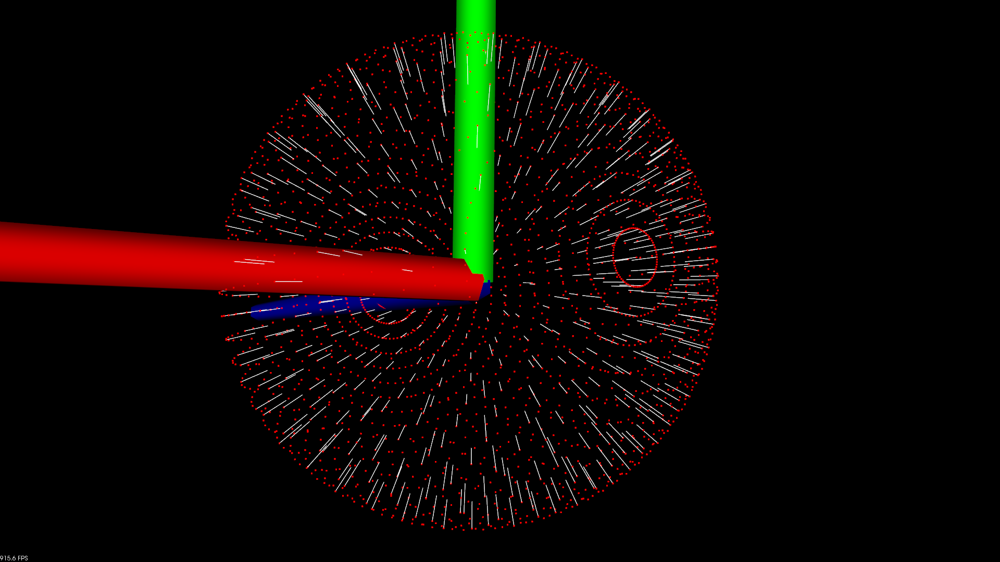

# 用积分图计算有序点云的法线

使用积分图计算一个有序点云的法线，注意该方法**只适用于有序点云**
表面法线是几何体表面的重要属性，在很多领域都有大量应用，例如：在进行光照渲染时产生符合可视习惯的效果时需要表面法线信息才能正常进行，对于一个已知的几何体表面，根据垂直于点表面的矢量，因此推断表面某一点的法线方向通常比较简单。

头文件

```c++
#include <pcl/features/integral_image_normal.h>
```

