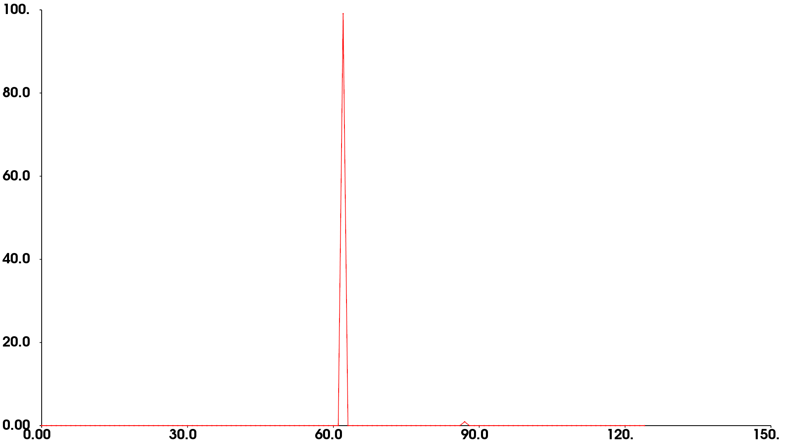

**横坐标表示角度，纵坐标表示区间内点云的数量**

# 点特征直方图(PFH)描述子

**计算法线---计算临近点对角度差值-----直方图--** 

 **点特征直方图(Point Feature Histograms)**

**正如点特征表示法所示**，**表面法线和曲率估计是某个点周围的几何特征基本表示法**。虽然计算非常快速容易，但是无法获得太多信息，因为它们只使用很少的几个参数值来近似表示一个点的k邻域的几何特征。然而大部分场景中包含许多特征点，这些特征点有相同的或者非常相近的特征值，因此采用点特征表示法，其直接**结果就减少了全局的特征信息**。

[文档细节非官网中文](http://www.pclcn.org/study/shownews.php?lang=cn&id=101)
[文档细节官网英文](http://pointclouds.org/documentation/tutorials/pfh_estimation.php) 

**通过参数化查询点与邻域点之间的空间差异**，**并形成一个多维直方图对点的k邻域几何属性进行描述**。直方图所在的高维超空间为特征表示提供了一个可度量的信息空间，对点云对应曲面的6维姿态来说它具有不变性，并且在不同的采样密度或邻域的噪音等级下具有鲁棒性。

**基于点与其k邻域之间的关系以及它们的估计法线**，简言之，它**考虑估计法线方向之间所有的相互作用**，试图捕获最好的样本表面变化情况，以描述样本的几何特征。Pq 用红色标注并放在圆球的中间位置，半径为r，(Pq)的所有k邻元素（即与点Pq的距离小于半径r的所有点）全部互相连接在一个网络中。最终的PFH描述子通过计算邻域内所有两点之间关系而得到的直方图，因此存在一个O($$nk^2$$) 的计算复杂性。每一点对，原有12个参数，6个坐标值，6个坐标姿态（基于法线）PHF计算每一对点的相对坐标角度差值，三个值和坐标点之间的欧氏距离 d 从12个参数减少到4个参数

computePairFeatures (const Eigen::Vector4f &p1, const Eigen::Vector4f &n1,
const Eigen::Vector4f &p2, const Eigen::Vector4f &n2,
float &f1, float &f2, float &f3, float &f4);

为查询点创建最终的PFH表示，所有的四元组将会以某种统计的方式放进直方图中，这个过程首先把每个特征值范围划分为b个子区间，并统计落在每个子区间的点数目，因为四分之三的特征在上述中为法线之间的角度计量，在三角化圆上可以将它们的参数值非常容易地归一到相同的区间内。默认PFH的实现使用5个区间分类（例如：四个特征值中的每个都使用5个区间来统计），其中不包括距离（在上文中已经解释过了——但是如果有需要的话，也可以通过用户调用computePairFeatures方法来获得距离值），这样就组成了一个125浮点数元素的特征向量（35），其保存在一个pcl::PFHSignature125的点类型中。
