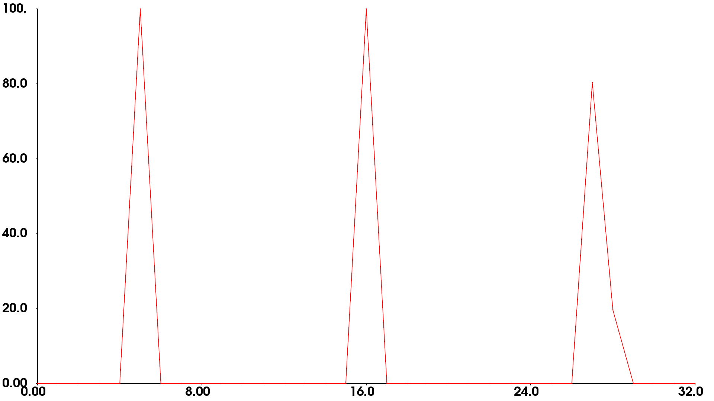

PFH是这样计算的：用点的法线夹角差异来描述两个点之间的关系，即用（α，β，θ）三个角度来描述，现在假设p0为当前点，然后搜索半径为r的邻域内的所有点，假设为（p1,p2,....,pk）,计算p0与各个点法线夹角偏差{（α1，β1，θ1）（α2，β2，θ2）.......（αk，βk，θk）}, 这里可以将α，β，θ分别作为一个立方体的三条边，然后将α，β，θ三个边分别划分为b个子区间，这样就有b3个小立方体，然后统计{（α1，β1，θ1）（α2，β2，θ2）.......（αk，βk，θk）}落到各个小立方体内的点的数目（纵坐标的含义），假设b=3，就有27个小立方体，直方图的横坐标就是0，1，...，26表示27个小立方体，纵坐标就是相应的点的数目（如下图所示）。所以小立方体内增加一个点，就对应一个值（α，β，θ），就是p0与某一点的法线偏差。从下FPFH直方图可以看出，直方图上都是一个一个的点的连线

p0与某个邻近点的法线偏差只是α，β，θ空间中的一点，这个不用被分成27个区间，我们只是人为的将α，β，θ整个大空间均匀的分成了27个小立方体，然后统计落在这27个小立方体的点(即法线偏差)的数目，小立方体就像学生宿舍楼中的宿舍，次序就像宿舍房号一样，本身已经被固定好了，把你分配到哪个宿舍是看你学的啥专业男的女的等信息，这些信息就像α，β，θ值，不同的个人信息会被分配到不同的宿舍。如果小立方体中增加一点，对应的就是增加了p0与某一临近点的法线偏差，法线偏差不同就落在了不同的小立方体中。希望能增加你的理解。

可参考，R.B. Rusu的博士论文http://files.rbrusu.com/publications/RusuPhDThesis.pdf

[参考](http://www.pclcn.org/bbs/forum.php?mod=viewthread&tid=137)

# FPFH点特征直方图

[参考](https://blog.csdn.net/u011736771/article/details/85103293)

**算复杂度还是太高**

计算法线---计算临近点对角度差值-----直方图--

因此存在一个O($$nk^2$$) 的计算复杂性。

k个点之间相互的点对 k×k条连接线，每一点对，原有12个参数，6个坐标值，6个坐标姿态（基于法线），PHF计算每一对点的相对坐标角度差值三个值和坐标点之间的欧氏距离 d 从12个参数减少到4个参数。

**快速点特征直方图FPFH**（Fast Point Feature Histograms）把算法的计算**复杂度降低到了O($$nk$$)** ，但是任然保留了PFH大部分的识别特性。查询点和周围k个点的连线 的4参数特征，也就是1×k=k个线，默认的FPFH实现使用11个统计子区间（例如：四个特征值中的每个都将它的参数区间分割为11个），特征直方图被分别计算然后合并得出了浮点值的一个33元素的特征向量，这些保存在一个pcl::FPFHSignature33点类型中。

# FPFH特征介绍
快速点特征直方图(Fast Point Feature Histograms, FPFH)是PFH计算方式的简化形式。它的思想在于分别计算查询点的k邻域中每一个点的简化点特征直方图(Simplified Point Feature Histogram,SPFH)，再通过一个公式将所有的SPFH加权成最后的快速点特征直方图。FPFH把算法的计算复杂度降低到了O(nk) ，但是任然保留了PFH大部分的识别特性。

# FPFH计算过程

1. 为查询点求得它和其k邻域内每个点之间的三个特征元素值，然后统计成一个SPFH；
2. 分别对k邻域中的每个点确定k邻域，按第一步分别形成自己的SPFH；
3. 对邻域中的各个SPFH进行加权统计，公式如下：

$$FPFH(p)=SPFH(p)+\frac{1}{k}\sum_{i=1}^k(\frac{1}{w_k}⋅SPFH(p^k))$$

其中权重$$w_k$$表示查询点$$p$$与给定度量空间中的近邻点$$p_k$$之间的距离。

# FPFH与PFH的主要区别

1. FPFH没有对全互连点的所有邻近点的计算参数进行统计，因此可能漏掉了一些重要的点对，而这些漏掉的对点可能对捕获查询点周围的几何特征有贡献。
2. PFH特征模型是对查询点周围的一个精确的邻域半径内，而FPFH还包括半径r范围以外的额外点对（但不超过2r的范围）；
3. 因为采用权重计算的方式，所以FPFH结合SPFH值，重新捕获邻近重要点对的几何信息；
4. 由于大大地降低了FPFH的整体复杂性，因此FPFH有可能使用在实时应用中；
5. 通过分解三元组，简化了合成的直方图。也就是简单生成d分离特征直方图，对每个特征维度来单独绘制，并把它们连接在一起。

# 利用OpenMP提高FPFH的计算速度
对于计算速度要求苛刻的用户，PCL提供了一个FPFH估计的另一实现，它使用多核/多线程规范，利用OpenMP开发模式来提高计算速度。这个类的名称是pcl::FPFHEstimationOMP，并且它的应用程序接口（API）100%兼容单线程pcl::FPFHEstimation，这使它适合作为一个替换元件。在8核系统中，OpenMP的实现可以在6-8倍更快的计算时间内完全同样单核系统上的计算。
