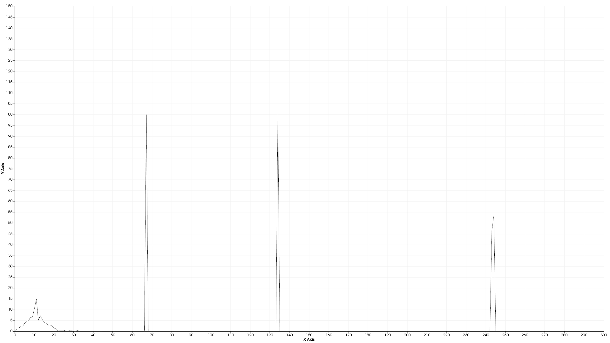
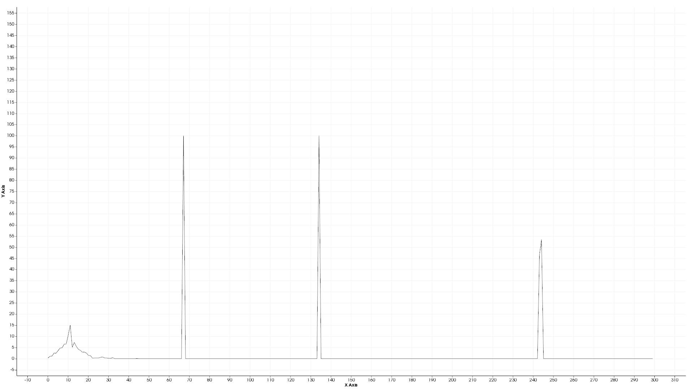

# 视点特征直方图VFH

[参考链接1](https://blog.csdn.net/u013235582/article/details/100835248)

[参考链接2](http://www.pclcn.org/study/shownews.php?lang=cn&id=95)

**Vector Field Histogram**算法，简称VFH算法，直译为“方向区间柱图法”。是一种由[人工势场法](https://zh.wikipedia.org/wiki/人工势场法)改进而来的机器人导航算法。

**视点特征直方图VFH**(Viewpoint Feature Histogram)描述子，这是一种**针对聚类(如对象)识别和6DOF姿态估计问题的点簇表示方法**。

## 算法核心思想

算法会计算各个方向的行进代价，该方向的障碍越多，代价越高，并且会累加该方向不同距离的障碍物（根据距离，[权重](https://zh.wikipedia.org/wiki/权重)不同）。

根据不同方向的行进代价，可以直观的用一个[柱状图](https://zh.wikipedia.org/wiki/柱状图)表示。**横坐标为0-360度的方向，纵坐标是该角度下的行进代价**。**柱状图越高，表示向该方向行进的代价越高，也表明越不可能通过**。

理论上，这个柱状图低的区域是便于行进的，但可能会偏离目标方向，因此，需要一个平衡函数来平衡行进代价和目标方向。最终，会选择一个相对最适宜的方向行进。于是这个函数便是整个算法的核心。

最新的VFH改进算法有VFH+,VFH\*。其中后者的星号源自[A\*搜寻算法](https://zh.wikipedia.org/wiki/A*搜寻算法)，顾名思义，该算法引入了A\*搜寻算法，将两者的优点结合起来。

# 其它

**特点**

1. 速度快

2. 识别能力强

**利用FPFH的强识别结果，在保持尺度不变的同时增加视点方差，区分不同的位姿**

我们做了以下两种计算来构造特征，以应用于目标识别问题和位姿估计：

1. 扩展FPFH，使其利用整个点云对象来进行计算估计（如2图所示），在计算FPFH时以物体中心点与物体表面其他所有点之间的点对作为计算单元。
2. 添加视点方向与每个点估计法线之间额外的统计信息，为了达到这个目的，我们的关键想法是在FPFH计算中将视点方向变量直接融入到相对法线角计算当中。