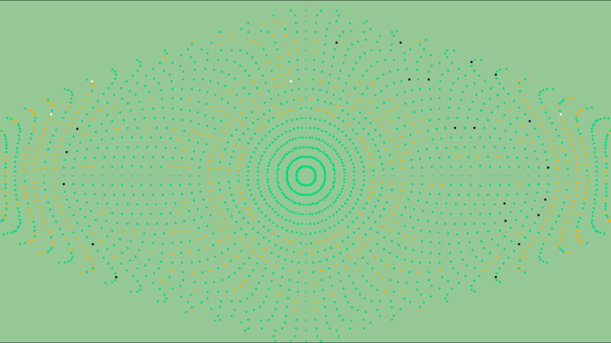

./show ../../datas/Sphere.pcd

[参考链接](http://www.pclcn.org/study/shownews.php?lang=cn&id=97)

## NARF（Normal Aligned Radial Feature）关键点

NARF(Normal Aligned Radial Feature)关键点是**为了从深度图像中识别物体而提出的**，对NARF关键点的提取过程有以下要求：

​	a)提取的过程考虑边缘以及物体表面变化信息在内；

​	b)在不同视角关键点可以被重复探测；

​	c)关键点所在位置有足够的支持区域，可以计算描述子和进行唯一的估计法向量。

   其对应的探测步骤如下：

   (1) 遍历每个深度图像点，通过寻找在近邻区域有深度变化的位置进行边缘检测。

   (2) 遍历每个深度图像点，根据近邻区域的表面变化决定一测度表面变化的系数，及变化的主方向。

   (3) 根据step(2)找到的主方向计算兴趣点，表征该方向和其他方向的不同，以及该处表面的变化情况，即该点有多稳定。

   (4) 对兴趣值进行平滑滤波。

   (5) 进行无最大值压缩找到的最终关键点，即为NARF关键点。

