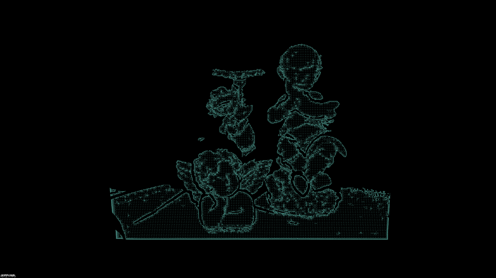
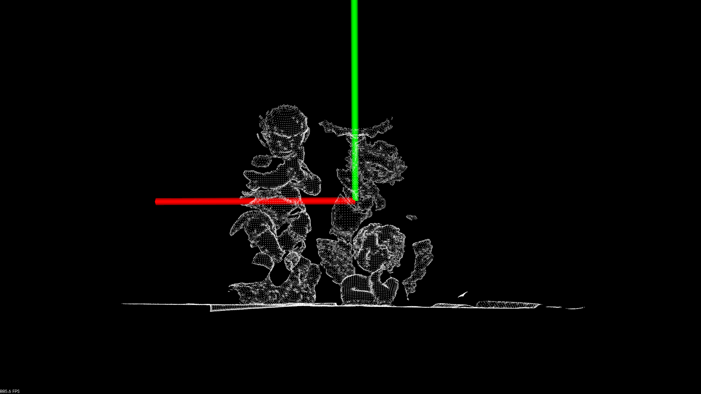
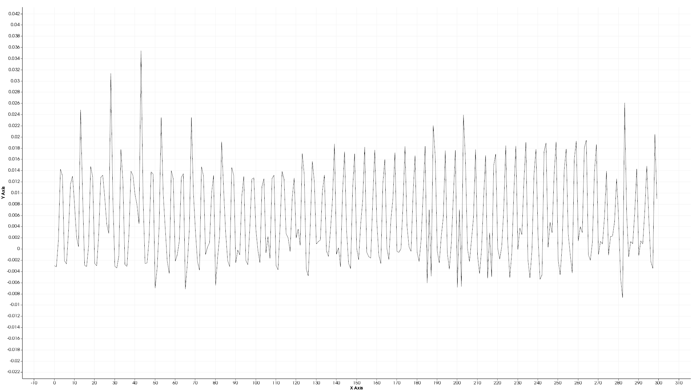

# RoPs特征描述子

Rotational Projection Statistics特征描述子

**旋转投影统计特征**

使用*pcl::ROPSEstimation*类来提取点特性

[参考链接](https://codeleading.com/article/69402196503/)

# 理论基础

特征提取方法的思想如下。**有了网格和一组必须计算特征的点**，我们执行一些简单的步骤。首先，对于给定的兴趣点，局部表面被裁剪。**局部曲面由给定支撑半径内的点和三角形组成**。**对给定的局部表面LRF(局部参考帧)进行了计算**。LRF只是向量的一个三元组，关于如何计算这些向量的综合信息可以在本文中找到。真正重要的是利用这些向量我们可以提供点云旋转的不变性。为此，我们简单地**平移局部表面的点，使感兴趣的点成为原点，然后旋转局部表面，使LRF向量与Ox、Oy和Oz轴对齐**。完成这些之后，我们就开始特征提取。对于每一个坐标轴Ox, Oy, Oz执行以下步骤，我们将这些坐标轴称为当前轴:

0. **在关键点处建立局部坐标系**
1. 在一个**给定的角度在当前坐标系下对关键点领域(局部表面) 进行旋转**
2. 把**局部表面投影到 xy，yz，xz三个2维平面**上
3. 在**每个投影平面上划分不同的盒子容器**，把**点分到不同的盒子**里
4. **根据落入每个盒子的数量**，来**计算每个投影面上的一系列数据分布**（熵值，低阶中心矩M11,M12,M21,M22，E。E是信息熵。4*2+1=9）进行描述
5. 计算值将会组成子特征。

 * 盒子数量 × 旋转次数×9 得到特征维度

我们把上面这些步骤进行多次迭代。不同坐标轴的子特征将组成RoPS描述器

我们首先要找到目标模型:

 * points 输入点云
 * indices RoPS特征点的标号（即关键点在点云中的下标）
 * triangles 三角面元

# 优点

(1) 鉴别力强：RoPS 通过旋转投影实现从多个视角记录局部表面的“完整”信息，因而信息量丰富。

(2) 不变性：通过构建局部参考坐标框架实现局部表面的姿态归一化，使得到的特征描述子具有对旋转和平移的不变性。

(3) 对噪声稳健：由于在各个二维投影平面上均进行稀疏划分且只采用低阶矩而非高阶矩来生成特征描述子，因而 RoPS 对噪声非常稳健。

(4) 对分辨率变化稳健：RoPS 通过计算局部表面上所有点而非仅仅三角面片顶点的协方差矩阵得到局部参考坐标框架，因而对数据分辨率变化不敏感。

(5) 紧凑性：将三维点云投影到二维平面并在二维平面提取五维特征的过程极大地降低了数据量，使得 RoPS 特征描述子维度较低。

[参考链接](https://yq.aliyun.com/articles/218553/)