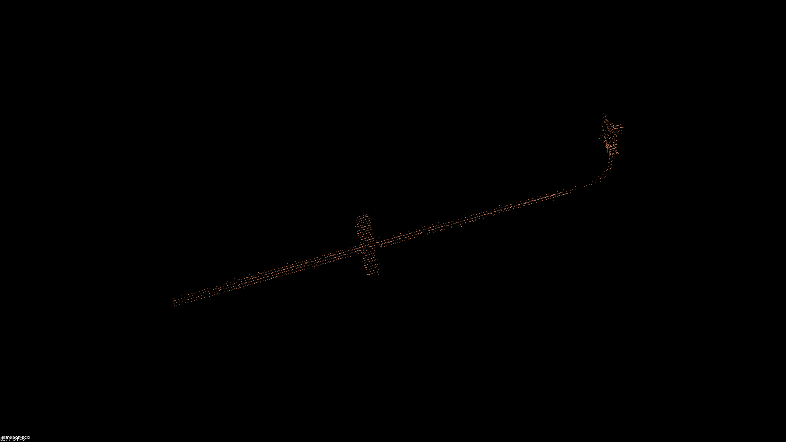
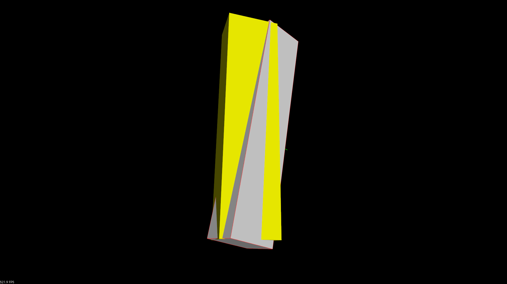
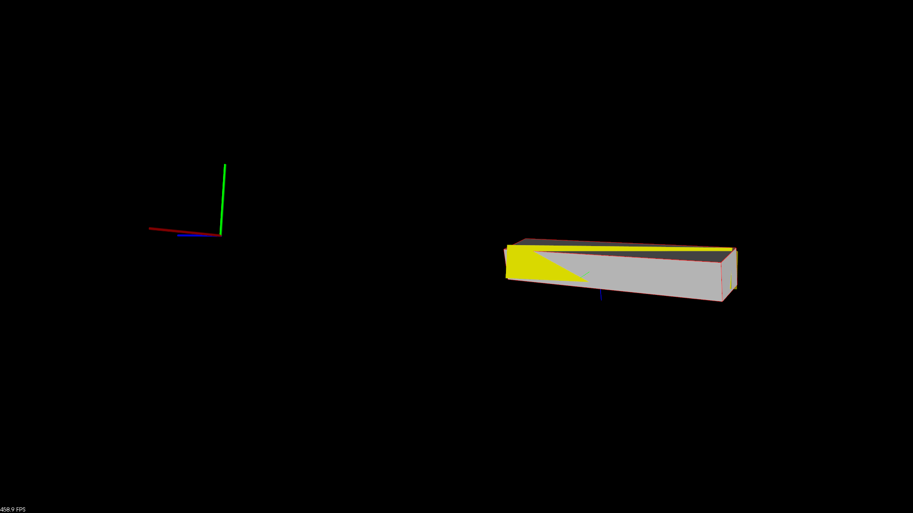
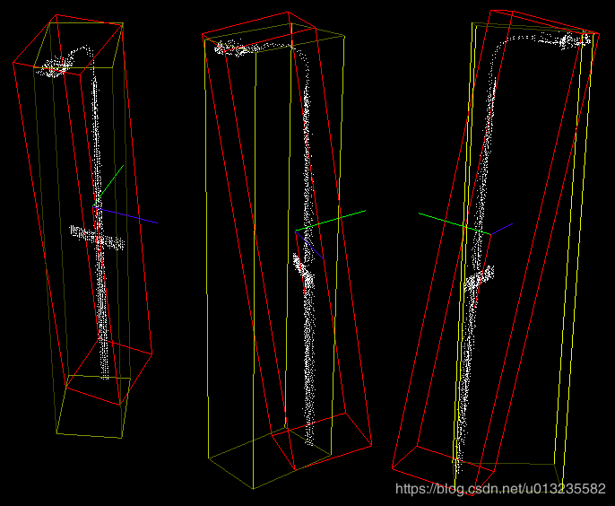
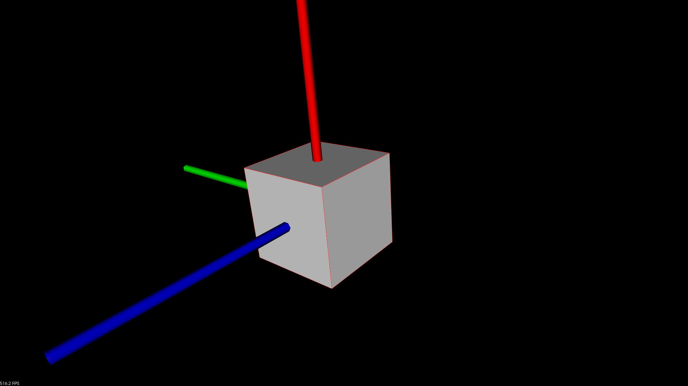
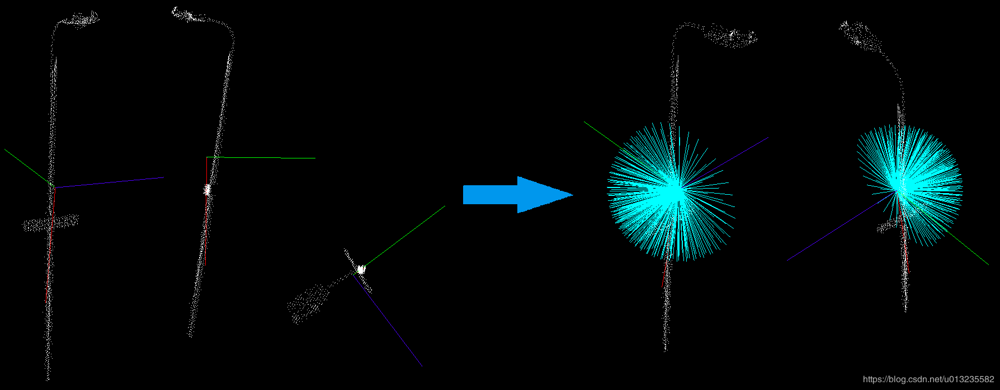
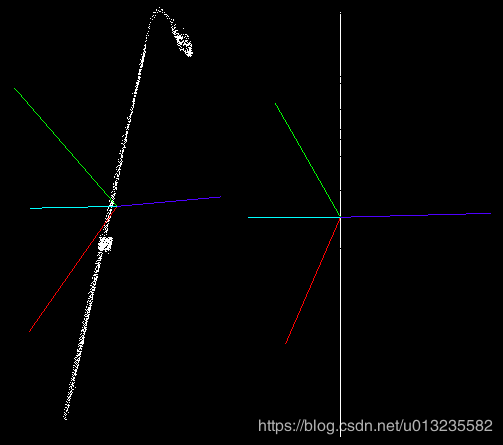

您应该会看到类似于此图像的内容。这里AABB是黄色的，OBB是红色的。你也可以看到特征向量。





# 惯性偏心矩描述子

## pcl::MomentOfInertiaEstimation

momentofinertiaestimation类获取基于惯性偏心矩描述子

[参考内容](https://blog.csdn.net/u013235582/article/details/100943131)

这个类允许提取云的轴对齐和定向包围盒。但请记住，不可能的最小提取OBB包围盒。

首先计算点云的协方差矩阵，提取其特征值和向量。你可以认为所得的特征向量是标准化的，总是形成右手坐标系（主要特征向量表示x轴，而较小的向量表示z轴）。在下一个步骤中，迭代过程发生。每次迭代时旋转主特征向量。旋转顺序总是相同的，并且在其他特征向量周围执行，这提供了点云旋转的不变性。此后，我们将把这个旋转主向量作为当前轴。

然后**在当前轴上计算转动惯量** 和 **将点云投影到以旋转向量为法线的平面上**

**计算偏心距**

## 理论基础

特征提取方法的思想如下。首先计算点云的协方差矩阵，提取点云的特征值和特征向量。可以考虑得到的特征向量是归一化的，并且总是基于右手坐标系(主特征向量表示x轴，副特征向量表示z轴)。下一步是迭代过程。在每次迭代中旋转主特征向量。旋转顺序总是相同的，并且是围绕其他特征向量执行的，这就提供了点云旋转的不变性。从此，我们将把这个旋转的主矢量称为当前轴。



对每一当前轴的转动惯量进行计算。此外，当前轴也用于偏心计算。因此，将当前矢量作为平面的法向量，并将输入云投影到其上。然后计算得到的投影偏心量。



实现的类还提供了获取AABB和OBB的方法。沿着特征向量，将有向包围盒计算为AABB。

# AABB 包围盒

 **AABB 包围盒是与坐标轴对齐的包围盒**，**简单性好，紧密性较差**(尤其对斜对角方向放置的瘦长形对象，采用AABB，**将留下非常大的边角空隙，导致大量不是必需的包围盒相交测试)**。当物体旋转之后需对AABB 进行相同的旋转并更新；当物体变形之后仅仅需对变形了的基本几何元素相应的包围盒又一次计算；然后能够自下向上由子结点的AABB 合成父结点的AABB，最后进行包围盒树的更新。

# OBB 包围盒

OBB 碰撞检测方法**紧密性是较好的**，可以大大降低參与相交测试的包围盒的数目，因此**整体性能要优于AABB 和包围球，而且实时性程度较高**。当物体发生旋转运动后，仅仅需对OBB 进行相同的旋转就可以。因此，对于刚体间的碰撞检测，OBB 不失为一种较好的选择。迄今为止，还没一种有效的方法可以较好地解决对象变形后OBB 树的更新问题，而又一次计算每一个结点的OBB 的代价又太大。所以**OBB 不适用于包括软体对象的复杂环境中**。

# 包围球

包围球碰撞检测方法是用球体包围整个几何体，不管是几何体还是相交测试都非常easy；可是它的**紧密性太差**。由于除了在3 个坐标轴上分布得比较均匀的几何体外，差点儿都会留下较大的空隙，须要花费大量的预处理时间，以构造一个好的层次结构逼近对象。当物体变形之后，包围球树需要又一次计算。因此,它是**使用得比较少的一种包围盒**。当对象发生旋转运动时，包围球不需作不论什么更新，这是包围球的较优秀特性；当几何对象进行频繁的旋转运动时，采用包围球可能得到较好结果。

```c++
#include <pcl/features/moment_of_inertia_estimation.h>
-------------------------------------------------------------------------------------
 pcl::MomentOfInertiaEstimation <pcl::PointXYZ> feature_extractor;// 惯量 偏心距 特征提取
  feature_extractor.setInputCloud (cloud_ptr);//输入点云
  feature_extractor.compute ();//计算

  std::vector <float> moment_of_inertia;// 惯量
  std::vector <float> eccentricity;// 偏心距
  pcl::PointXYZ min_point_AABB;
  pcl::PointXYZ max_point_AABB;
  pcl::PointXYZ min_point_OBB;
  pcl::PointXYZ max_point_OBB;
  pcl::PointXYZ position_OBB;
  Eigen::Matrix3f rotational_matrix_OBB;
  float major_value, middle_value, minor_value;
  Eigen::Vector3f major_vector, middle_vector, minor_vector;
  Eigen::Vector3f mass_center;

  feature_extractor.getMomentOfInertia (moment_of_inertia);// 惯量
  feature_extractor.getEccentricity (eccentricity);// 偏心距
// 以八个点的坐标 给出 包围盒
  feature_extractor.getAABB (min_point_AABB, max_point_AABB);// AABB 包围盒坐标 八个点的坐标
// 以中心点 姿态 坐标轴范围 给出   包围盒
  feature_extractor.getOBB (min_point_OBB, max_point_OBB, position_OBB, rotational_matrix_OBB);// 位置和方向姿态
  feature_extractor.getEigenValues (major_value, middle_value, minor_value);//特征值
  feature_extractor.getEigenVectors (major_vector, middle_vector, minor_vector);//特征向量
  feature_extractor.getMassCenter (mass_center);//点云中心点
```
