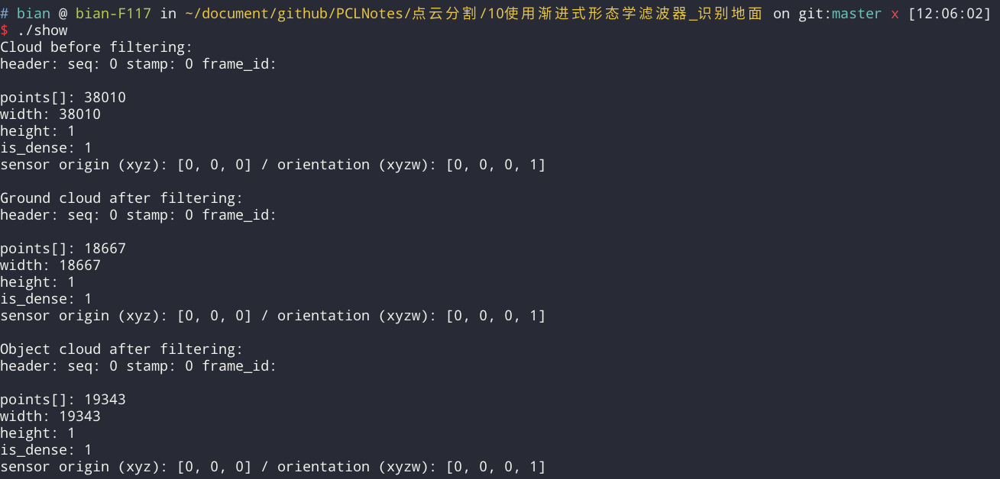
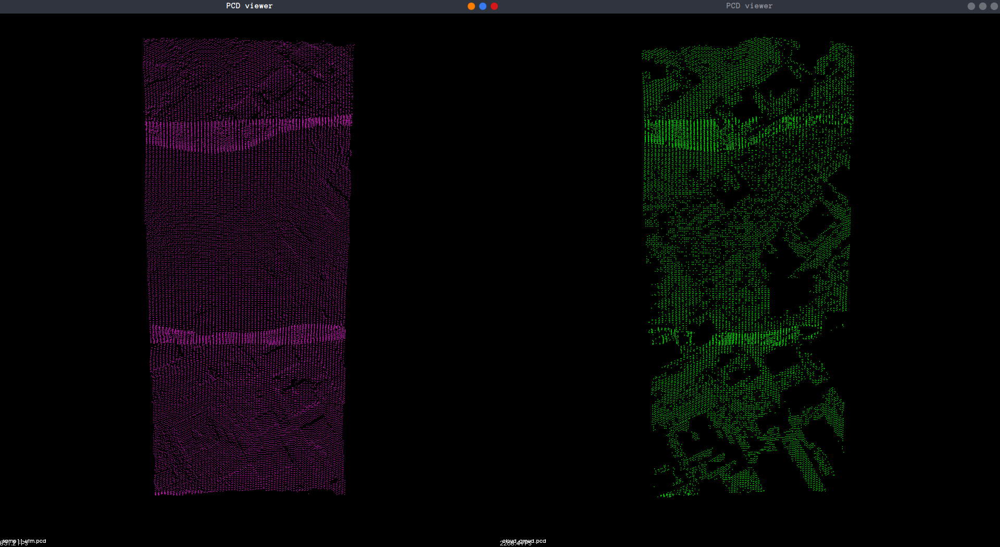
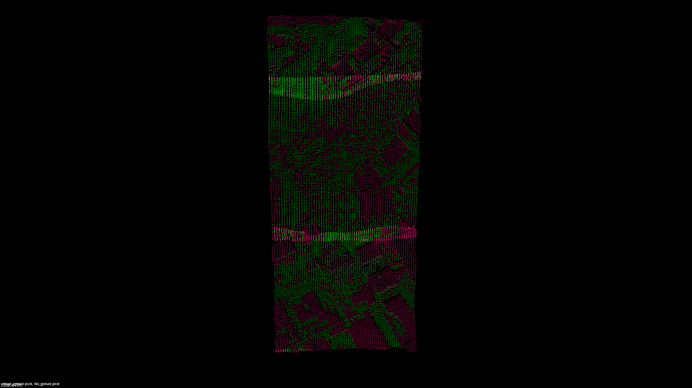

 

 

# pcl::ProgressiveMorphologicalFilter

点云滤波是LiDAR制图应用中的一个重要模块，即从**地形测量点云中分离出地面点与非地面点**。在GIS空间分析和空间关系运算的基础上，提出了**以空间格网索引结构组织离散点云的方法**。同时建模实现对离散点云处理的**渐进式形态学滤波算法**，最后通过**定量分析论证了滤波算法的可行性以及滤波效果**
