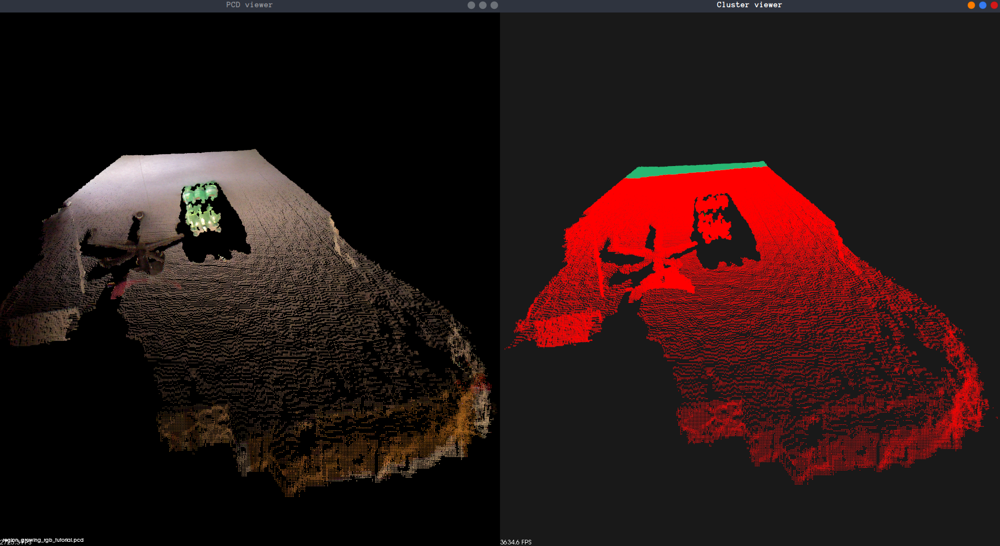

 

# 基于颜色的区域生长分割法
除了普通点云之外，还有一种特殊的点云，称为RGB点云。
显而易见，这种点云除了结构信息之外，还存在颜色信息。
将物体通过颜色分类，是人类在辨认果实的过程中进化出的能力，
颜色信息可以很好的将复杂场景中的特殊物体分割出来。
比如Xbox、Kinect就可以轻松的捕捉颜色点云。
**基于颜色的区域生长分割原理上和基于曲率，法线的分割方法是一致的。**
只不过比较目标换成了颜色，去掉了点云规模上限的限制。
可以认为，同一个颜色且挨得近，是一类的可能性很大，不需要上限来限制。
所以这种方式**比较适合用于室内场景分割**。
尤其是复杂室内场景，颜色分割可以轻松的将连续的场景点云变成不同的物体。
哪怕是高低不平的地面，设法用采样一致分割器抽掉平面，
颜色分割算法对不同的颜色的物体实现分割。
 
算法分为两步：
 
（1）分割，当前种子点和领域点之间色差小于色差阀值的视为一个聚类
 
（2）合并，聚类之间的色差小于色差阀值和并为一个聚类，
  且当前聚类中点的数量小于聚类点数量的与最近的聚类合并在一起
