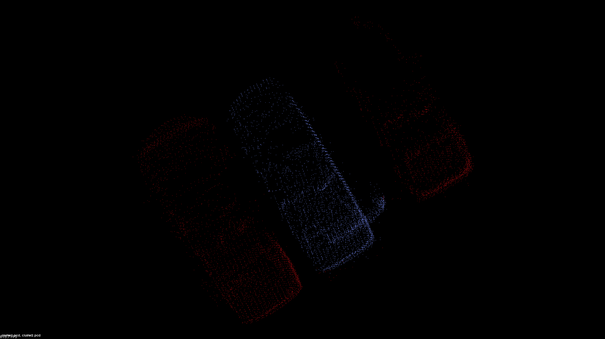
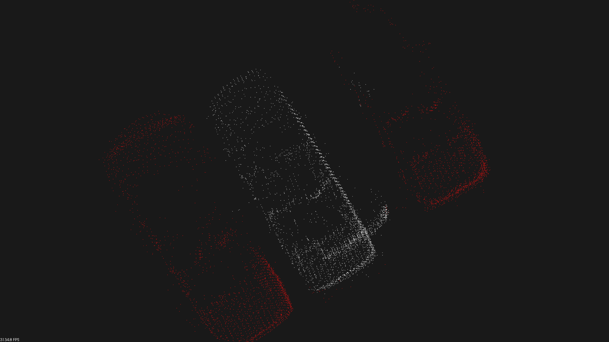
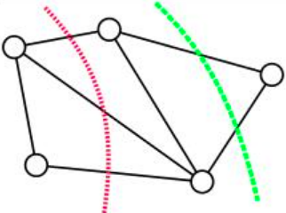

# pcl::MinCutSegmentation

最小分割算法  (分割点云)
该算法是将一幅点云图像分割为两部分：
前景点云（目标物体）和背景物体（剩余部分）

# 点云分割的精度

​		在之前的两个章节里介绍了基于采样一致的点云分割和基于临近搜索的点云分割算法。基于采样一致的点云分割算法显然是意识流的，它只能割出大概的点云（可能是杯子的一部分，但杯把儿肯定没分割出来）。基于欧式算法的点云分割面对有牵连的点云就无力了（比如风筝和人，在不用三维形态学去掉中间的线之前，是无法分割风筝和人的）。基于法线等信息的区域生长算法则对平面更有效，没法靠它来分割桌上的碗和杯子。也就是说，上述算法更关注能不能分割，除此之外，我们还需要一个方法来解决分割的“好不好”这个问题。也就是说，有没有哪种方法，可以在一个点不多，一个点不少的情况下，把目标和“其他”分开。

　	答案是有，也就是要解决的最小割算法。

# 最小割算法

The Min-Cut (minimum cut) algorithm最小割算法是图论中的一个概念，
其作用是以某种方式，将两个点分开，当然这两个点中间可能是通过无数的点再相连的。

如果要分开最左边的点和最右边的点，红绿两种割法都是可行的，
但是红线跨过了三条线，绿线只跨过了两条。
单从跨线数量上来论可以得出绿线这种切割方法更优的结论。
但假设线上有不同的权值，那么最优切割则和权值有关了。
当你给出了点之间的 “图” ，以及连线的权值时，
最小割算法就能按照要求把图分开。

所以那么怎么来理解点云的图呢？
显而易见，切割有两个非常重要的因素，
第一个是获得点与点之间的拓扑关系，这种拓扑关系就是生成一张 “图”。
第二个是给图中的连线赋予合适的权值。
只要这两个要素合适，最小割算法就会正确的分割出想要的结果。
点云是分开的点。只要把点云中所有的点连起来就可以了。

连接算法如下：
   	   1. 找到每个点临近的n个点
            	   2. 将这n个点和父点连接
                  	   3. 找到距离最小的两个块（A块中某点与B块中某点距离最小），并连接
                        	   4. 重复3，直至只剩一个块

经过上面的步骤现在已经有了点云的“图”，只要给图附上合适的权值，就满足了最小分割的前提条件。
物体分割比如图像分割给人一个直观印象就是属于该物体的点，应该相互之间不会太远。
也就是说，可以用点与点之间的欧式距离来构造权值。
所有线的权值可映射为线长的函数。 

$$cost = exp(-(dist/cet)^2)$$  距离越远　cost越小　越容易被分割

我们知道这种分割是需要指定对象的，也就是我们指定聚类的中心点（center）以及聚类的半径（radius），
当然我们指定了中心点和聚类的半径，那么就要被保护起来，保护的方法就是增加它的权值.

$$dist2Center / radius$$

$$dist2Center　＝　sqrt((x-x_center)^2+(y-y_center)^2)$$
