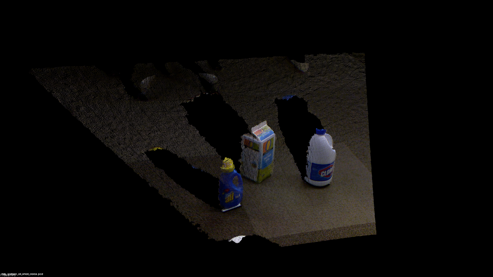
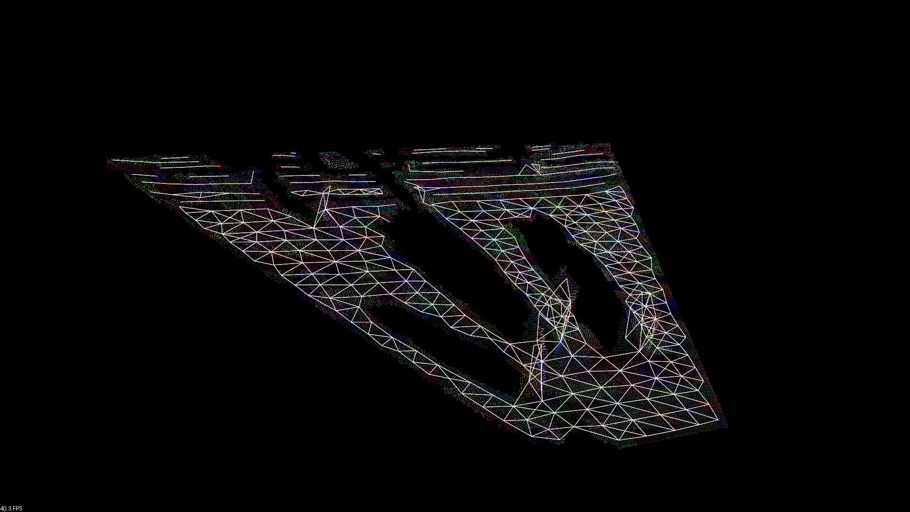
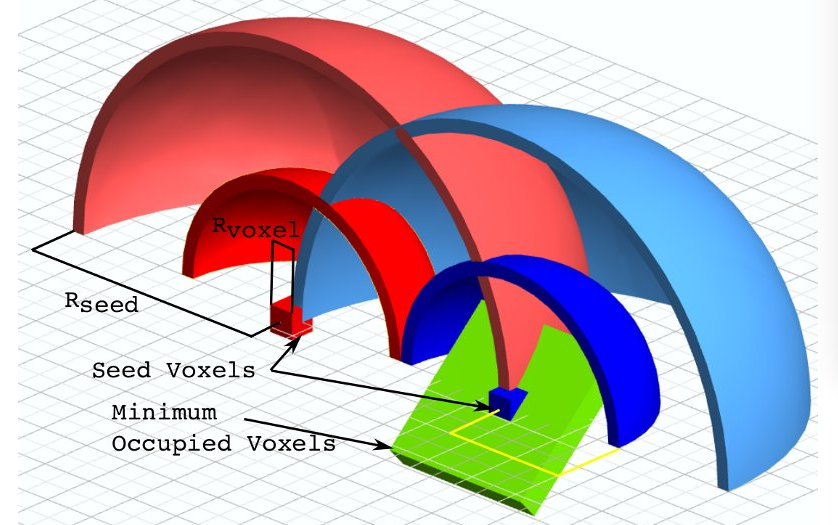
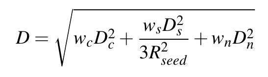

# pcl::SupervoxelClustering

# 超体聚类  
超体聚类是一种**图像的分割方法**。

超体（supervoxel）是一种集合，集合的元素是“体”。与体素滤波器中的体类似，其本质是一个个的小方块。与大部分的分割手段不同，超体聚类的**目的并不是分割出某种特定物体**，超体是**对点云实施过分割(over segmentation)，将场景点云化成很多小块，并研究每个小块之间的关系**。这种将更小单元合并的分割思路已经出现了有些年份了，在图像分割中，像素聚类形成超像素，以超像素关系来理解图像已经广为研究。**本质上这种方法是对局部的一种总结**，**纹理，材质，颜色类似的部分会被自动的分割成一块，有利于后 续识别工作**。比如对人的识别，如果能将头发，面部，四肢，躯干分开，则能更好的对各种姿态，性别的人进行识别。

点云和图像不一样，其不存在像素邻接关系。所以，超体聚类之前，必须以八叉树对点云进行划分，获得不同点团之间的邻接关系。与图像相似点云的邻接关系也有很多，如面邻接，线邻接，点邻接。

**超体聚类实际上是一种特殊的区域生长算法**，和无限制的生长不同，超体聚类首先需要规律的布置区域生长“晶核”。**晶核在空间中实际上是均匀分布的**,并指定晶核距离（Rseed)。再指定粒子距离(Rvoxel)。再指定最小晶粒(MOV)，过小的晶粒需要融入最近的大晶粒。

有了晶粒和结晶范围之后，我们只需要控制结晶过程，就能将整个空间划分开了。结晶过程的本质就是不断吸纳类似的粒子（八分空间）。类似是一个比较模糊的概念，关于类似的定义有以下公式：

公式中的Dc,表示颜色上的差异，Dn表示法线上的差异，Ds代表点距离上的差异。w_*表示一系列权重。用于控制结晶形状。在晶核周围寻找一圈，D最小的体素被认为是下一个“被发展的党员”。需要注意的是，结晶过程并不是长完一个晶核再长下一个，二是所有的晶核同时开始生长（虽然计算机计算时必然有先后，但从层次上来说是同时的）。其生长顺序如下图所示：

接下来所有晶核继续公平竞争，发展第二个“党员”，以此循环，最终所有晶体应该几乎同时完成生长。整个点云也被晶格所分割开来。并且保证了一个晶包里的粒子都是类似的。

# 应用

此方法主要为识别做前期准备，但这种东西用在三维视觉+有限元倒是极好的。可以在不使用应变片的前提下对物体各个部分应变进行直接测量。在已知力的情况下可以建立物体刚度和应变的关系，貌似钢包回转台的手里分析可以这样解决。实际工业机械哪有那么多花花绿绿的给你分割，很难形成有效的对应点匹配。