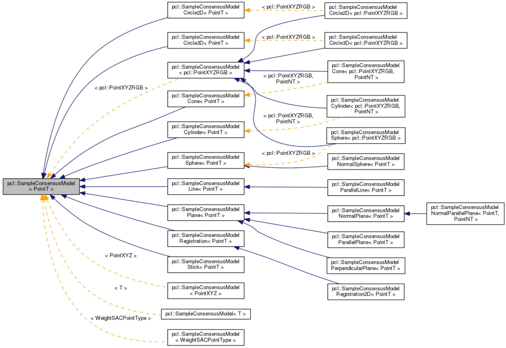

# 概述

### 解决能不能分割的算法

基于采样一致性点云分割算法是意识流的，只能割出大概的点云（可能是杯子的一部分，但杯把儿肯定没分割出来）

基于欧式算法的点云分割面对有牵连的点云就无力了（比如风筝和人，在不用三维形态学去掉中间的线之前，是无法分割风筝和人的）

基于法线等信息的区域生长算法则对平面更有效，没法靠它来分割桌上的碗和杯子

### 解决分割的“好不好”的算法

最小割算法

### 主要内容个人总结

1. **基于采样一致性，利用模型分割点云形状**——Sample_consensus
2. **基于采样一致性，利用模型参数分割点云**——SACSegmentation
3. ****基于采样一致性，有条件约束的平面分割**。当环境比较复杂时，我们可以采用setModelType设置模型约束平面的法向方向，更加准确的分割出平面点云。依据法线分割点云——SACSegmentationFromNormals。栗子：(SACMODEL_NORMAL_PARALLEL_PLANE设置分割模型为带约束的平面等)
4. **欧式聚类**，**适用于距离分散的**。从一个点出发，最终占领整个被分割区域，**依据距离远近**。
5. **区域生成的分割法**，具有相似性的像素集合起来构成区域。从一个点出发，最终占领整个被分割区域，对普通点云的区域生长，其由法线、曲率估计算法获得其法线和曲率值。**通过法线和曲率来判断某点是否属于该类**
6. **基于颜色的区域生长分割法**，对RGB点云有效，**比较适合用于室内场景分割**，颜色分割算法对不同的颜色的物体实现分割。
7. **最小分割算法**：将一幅点云图像分割为两部分：**前景点云（目标物体）和背景物体（剩余部分）**
8. **基于点云频率的滤波方法**，这里使用**DoN**算法（比较先进的**点云滤波算法**）。目的是在**去除点云低频滤波，低频信息（例如建筑物墙面，地面）**往往会对分割产生干扰，**高频信息（例如建筑物窗框，路面障碍锥）往往尺度上很小**，直接采用**基于临近信息的滤波器**会将此类信息合并至墙面或路面中
9. **超体聚类（图像分割方法）**，其**目的并不是分割出某种特定物体**，超体是**对点云实施过分割(over segmentation)，将场景点云化成很多小块，并研究每个小块之间的关系**。在图像分割中，像素聚类形成超像素，以超像素关系来理解图像已经广为研究。**本质上这种方法是对局部的一种总结**，**纹理，材质，颜色类似的部分会被自动的分割成一块，有利于后续识别工作**。比如对人的识别，如果能将头发，面部，四肢，躯干分开，则能更好的对各种姿态，性别的人进行识别。可以在不使用应变片的前提下对物体各个部分应变进行直接测量。在已知力的情况下可以建立物体刚度和应变的关系。
10. 渐进式形态学滤波算法，即从**地形测量点云中分离出地面点与非地面点**。在GIS空间分析和空间关系运算的基础上，提出了**以空间格网索引结构组织离散点云的方法**。同时建模实现对离散点云处理的**渐进式形态学滤波算法**，最后通过**定量分析论证了滤波算法的可行性以及滤波效果**

# 点云分割

1. 区域提取
2. 线面提取
3. 语义分割与聚类等

## 分割

1. 区域声场
2. Ransac线面提取
3. NDT-RANSAC
4. K-Means
5. Normalize Cut
6. 3D Hough Transform(线面提取)
7. 连通分析

## 分类

1. 基于点的分类
2. 基于分割的分类
3. 监督分类与非监督分类

## 语义分类

获取场景点云之后，如何有效的利用点云信息，如何理解点云场景的内容，进行点云的分类很有必要，需要为每个点云进行Labeling。

1. 从目标上可以分为基于点的分类方法和基于分割的分类方法。

2. 从方法上可以分为基于监督分类的技术或者非监督分类技术。
深度学习也是一个很有希望应用的技术

## 随机采样一致性　采样一致性算法　sample_consensus

在计算机视觉领域广泛的使用各种不同的采样一致性参数估计算法用于排除错误的样本，样本不同对应的应用不同，例如剔除错误的配准点对，分割出处在模型上的点集，PCL中以随机采样一致性算法（RANSAC）为核心，同时实现了五种类似与随机采样一致形算法的随机参数估计算法:

1. 随机采样一致性算法（RANSAC）
2. 最大似然一致性算法（MLESAC）
3. 最小中值方差一致性算法（LMEDS）

所有估计参数算法都符合一致性原则。
在PCL中设计的采样一致性算法的应用主要就是对点云进行分割，根据设定的不同的几个模型，估计对应的几何参数模型的参数，在一定容许的范围内分割出在模型上的点云。 

### RANSAC随机采样一致性算法的介绍

RANSAC是“RANdom SAmple Consensus（随机抽样一致）”的缩写。

它可以从一组包含“局外点”的观测数据集中，通过迭代方式估计数学模型的参数。

它是一种**不确定的算法**——它有一定的概率得出一个合理的结果；

为了**提高概率必须提高迭代次数**。
数据分两种：

​	**有效数据（inliers）**	和	**无效数据（outliers）**。

>  偏差不大的数据称为有效数据
>  偏差大的数据称为无效数据

如果有效数据占大多数，无效数据只是少量时，我们可以通过**最小二乘法**或类似的方法来确定模型的参数和误差；如果无效数据很多（比如**超过了50%的数据都是无效数据**），**最小二乘法就失效了**，我们需要新的算法。

一个简单的例子是从一组观测数据中找出合适的2维直线。假设观测数据中包含局内点和局外点，其中局内点近似的被直线所通过，而局外点远离于直线。简单的最小二乘法不能找到适应于局内点的直线，原因是最小二乘法尽量去适应包括局外点在内的所有点。相反，RANSAC能得出一个仅仅用局内点计算出模型，并且概率还足够高。但是，RANSAC并不能保证结果一定正确，为了保证算法有足够高的合理概率，我们必须小心的选择算法的参数。包含很多局外点的数据集   RANSAC找到的直线（局外点并不影响结果）

### RANSAC算法概述

RANSAC算法的输入是一组观测数据，一个可以解释或者适应于观测数据的参数化模型，一些可信的参数。RANSAC通过反复选择数据中的一组随机子集来达成目标。被选取的子集被假设为局内点，并用下述方法进行验证：

1.有一个模型适应于假设的局内点，即所有的未知参数都能从假设的局内点计算得出。
2.用1中得到的模型去测试所有的其它数据，如果某个点适用于估计的模型，认为它也是局内点。
3.如果有足够多的点被归类为假设的局内点，那么估计的模型就足够合理。
4.然后，用所有假设的局内点去重新估计模型，因为它仅仅被初始的假设局内点估计过。
5.最后，通过**估计局内点与模型的错误率来评估模型**。

输入：

```
data —— 一组观测数据
model —— 适应于数据的模型
n —— 适用于模型的最少数据个数
k —— 算法的迭代次数
t —— 用于决定数据是否适应于模型的阀值
d —— 判定模型是否适用于数据集的数据数目
```

输出：

```c++
best_model —— 跟数据最匹配的模型参数（如果没有找到好的模型，返回null）
best_consensus_set —— 估计出模型的数据点
best_error —— 跟数据相关的估计出的模型错误
 
开始：
iterations = 0
best_model = null
best_consensus_set = null
best_error = 无穷大
while ( iterations < k )
    maybe_inliers = 从数据集中随机选择n个点
    maybe_model = 适合于maybe_inliers的模型参数
    consensus_set = maybe_inliers
    for ( 每个数据集中不属于maybe_inliers的点 ）
    if ( 如果点适合于maybe_model，且错误小于t ）
    	将点添加到consensus_set
    if （ consensus_set中的元素数目大于d ）
    已经找到了好的模型，现在测试该模型到底有多好
    better_model = 适合于consensus_set中所有点的模型参数
    this_error = better_model究竟如何适合这些点的度量
    if ( this_error < best_error )
        我们发现了比以前好的模型，保存该模型直到更好的模型出现
        best_model =  better_model
        best_consensus_set = consensus_set
        best_error =  this_error
    增加迭代次数
返回 best_model, best_consensus_set, best_error    
```

### 最小中值法（LMedS）

LMedS的做法很简单，就是从样本中随机抽出N个样本子集，使用**最大似然（通常是最小二乘）**对每个子集计算模型参数和该模型的偏差，**记录该模型参数及子集中所有样本中偏差居中的那个样本的偏差**（即Med偏差），最后选取N个样本子集中Med偏差最小的所对应的模型参数作为我们要估计的模型参数。

### 在PCL中sample_consensus模块支持的几何模型：

| SacModel                       | 模型         | 参数                                                         |
| ------------------------------ | ------------ | ------------------------------------------------------------ |
| SACMODEL_PLANE                 | 平面模型     | [normal_x normal_y normal_z d]                               |
| SACMODEL_LINE                  | 线模型       | [point_on_line.x point_on_line.y point_on_line.z line_direction.x line_direction.y line_direction.z] |
| SACMODEL_CIRCLE2D              | 平面圆模型   | [center.x center.y radius]                                   |
| SACMODEL_CIRCLE3D              | 三维圆模型   | [center.x, center.y, center.z, radius, normal.x, normal.y, normal.z] |
| SACMODEL_SPHERE                | 球模型       |                                                              |
| SACMODEL_CYLINDER              | 圆柱体模型   | [point_on_axis.x point_on_axis.y point_on_axis.z axis_direction.x axis_direction.y axis_direction.z radius] |
| SACMODEL_CONE                  | 圆锥体模型   | [apex.x, apex.y, apex.z, axis_direction.x, axis_direction.y, axis_direction.z, opening_angle] |
| SACMODEL_TORUS                 | 圆环模型     |                                                              |
| SACMODEL_PARALLEL_LINE         | 平行线       | [point_on_line.x point_on_line.y point_on_line.z line_direction.x line_direction.y line_direction.z] |
| SACMODEL_PERPENDICULAR_PLANE   | 垂直面模型   |                                                              |
| SACMODEL_PARALLEL_LINES        |              |                                                              |
| SACMODEL_NORMAL_PLANE          | 法平面模型   |                                                              |
| SACMODEL_NORMAL_SPHERE         | 法向球模型   |                                                              |
| SACMODEL_REGISTRATION          |              |                                                              |
| SACMODEL_REGISTRATION_2D       |              |                                                              |
| SACMODEL_PARALLEL_PLANE        | 平行平面模型 |                                                              |
| SACMODEL_NORMAL_PARALLEL_PLANE | 法向平行平面 |                                                              |
| SACMODEL_STICK                 |              |                                                              |

### PCL中Sample_consensus模块及类的介绍

PCL中Sample_consensus库实现了**随机采样一致性及其泛化估计算法**，例如平面，柱面，等各种常见的几何模型，**用不同的估计算法和不同的几何模型自由的结合估算点云中隐含的具体几何模型的系数**，实现对点云中所处的几何模型的分割，线，平面，柱面 ，和球面都可以在PCL 库中实现，平面模型经常被用到常见的室内平面的分割提取中， 比如墙，地板，桌面，其他模型常应用到根据几何结构检测识别和分割物体中，一共可以分为两类：

1. 一类是针对采样一致性及其泛化函数的实现
2.  一类是几个不同模型的具体实现，例如：平面，直线，圆球等

pcl::SampleConsensusModel< PointT >是随机采样一致性估计算法中不同模型实现的基类，所有的采样一致性估计模型都继承于此类，定义了采样一致性模型的相关的一般接口，具体实现由子类完成，其继承关系。

### 模型

pcl::SampleConsensusModel< PointT >
  |
  |
  |
  |_______________->pcl::SampleConsensusModelPlane< PointT >
      ->pcl::SampleConsensusModelLine< PointT >
      ->pcl::SampleConsensusModelCircle2D< PointT >  实现采样一致性 计算二维平面圆周模型
      ->pcl::SampleConsensusModelCircle3D< PointT >  实现采样一致性计算的三维椎体模型
      ->pcl::SampleConsensusModelSphere< PointT >
      ->pcl::SampleConsensusModelCone< PointT ,PointNT >
      ->pcl::SampleConsensusModelCylinder< PointT ,PointNT >
      ->pcl::SampleConsensusModelRegistration< PointT >			
      ->pcl::SampleConsensusModelStick< PointT >



pcl::SampleConsensus< T > 是采样一致性算法的基类

```
1.SampleConsensus(const SampleConsensusModelPtr &model, double threshold, bool random=false)
  其中model设置随机采样性算法使用的模型，threshold 阀值 
2.设置模型      void     setSampleConsensusModel (const SampleConsensusModelPtr &model)
3.设置距离阈值  void     setDistanceThreshold (double threshold)
4.获取距离阈值  double   getDistanceThreshold ()
5.设置最大迭代次数 void  setMaxIterations (int max_iterations)
6.获取最大迭代次数 int   getMaxIterations ()
```
