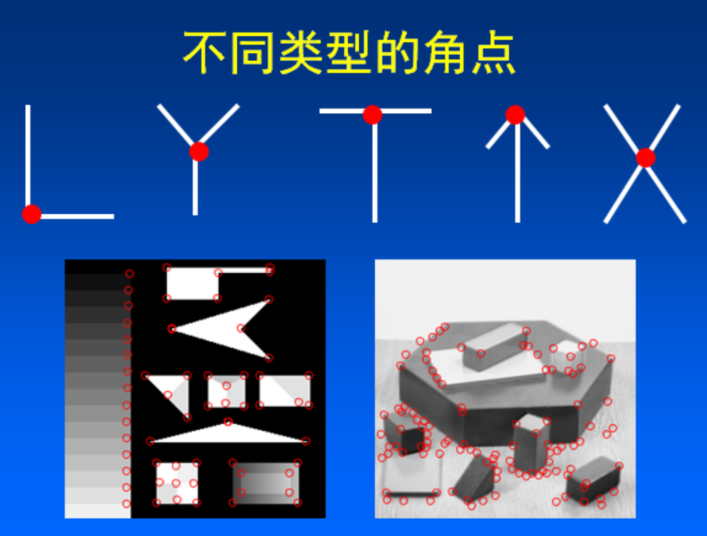
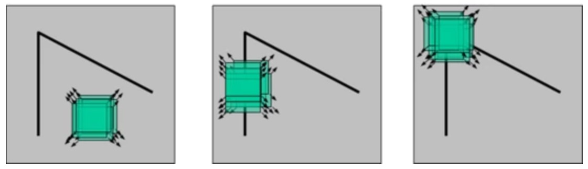

# 背景

在二维图像上，有Harris、SIFT、SURF、KAZE这样的关键点提取算法，这种特征点的思想可以推广到三维空间。

关键点的数量相比于原始点云或图像的数据量减小很多，与局部特征描述子结合在一起，组成**关键点描述子**常用来形成原始数据的表示，而且不失代表性和描述性，从而加快了后续的识别，追踪等对数据的处理了速度，故而，关键点技术成为在2D和3D 信息处理中非常关键的技术。

## 关键点提取算法

常见的三维点云关键点提取算法有一下几种：

1. ISS3D
2. Harris3D
3. NARF
4. SIFT3D这些算法在PCL库中都有实现

其中NARF算法用的比较多。

## PCL—低层次视觉—关键点检测

关键点又称为感兴趣的点，是低层次视觉通往高层次视觉的捷径，抑或是高层次感知对低层次处理手段的妥协。

关键点检测往往需要和特征提取联合在一起，关键点检测的一个重要性质就是旋转不变性，也就是说，物体旋转后还能够检测出对应的关键点。不过说实话我觉的这个要求对机器人视觉来说是比较鸡肋的。因为机器人采集到的三维点云并不是一个完整的物体，没哪个相机有透视功能。机器人采集到的点云也只是一层薄薄的蒙皮。所谓的特征点又往往在变化剧烈的曲面区域，那么从不同的视角来看，变化剧烈的曲面区域很难提取到同样的关键点。想象一下一个人的面部，正面的时候鼻尖可以作为关键点，但是侧面的时候呢？会有一部分面部在阴影中，模型和之前可能就完全不一样了

---------------------------------------------------------------------------
## 一 ISS3D

ISS算法的全程是Intrinsic Shape Signatures，第一个词叫做内部。说内部，那必然要有个范围，具体是什么东西的范围还暂定。如果说要描述一个点周围的局部特征，而且这个物体在全局坐标下还可能移动，那么有一个好方法就是在这个点周围建立一个局部坐标。只要保证这个局部坐标系也随着物体旋转就好。

**方法1基于协方差矩阵**
协方差矩阵的思想其实很简单，实际上它是一种耦合，把两个步骤耦合在了一起

1. 把pi和周围点pj的坐标相减：本质上这生成了许多从pi->pj的向量，理想情况下pi的法线应该是垂直于这些向量的
2. 利用奇异值分解求这些向量的0空间，拟合出一个尽可能垂直的向量，作为法线的估计

奇异值分解需要矩阵乘以自身的转置从而得到对称矩阵。
用协方差计算的**好处是可以给不同距离的点附上不同的权重**。

**方法2基于齐次坐标**

1. 把点的坐标转为齐次坐标
2. 对其次坐标进行奇异值分解
3. 最小奇异值对应的向量就是拟合平面的方程
4. 方程的系数就是法线的方向。

显然，这种方法更加简单粗暴，省去了权重的概念，但是换来了运算速度，不需要反复做减法。其实本来也不需要反复做减法，做一个点之间向量的检索哈希表即好可。**PCL的实现是利用反复减法的**。

有三个相互垂直的向量，一个是法线方向，另外两个方向与之构成了在某点的局部坐标系。在此局部坐标系内进行建模，就可以达到点云特征旋转不变的目的了。

ISS特征点检测的思想也甚是简单：

1. 利用**方法1**建立模型
2. 其利用特征值之间关系来形容该点的特征程度。

显然这种情况下的特征值是有几何意义的，**特征值的大小实际上是椭球轴的长度**。
**椭球的的形态则是对邻近点分布状态的抽象总结**。

试想，如果临近点沿某个方向分布致密则该方向会作为椭球的第一主方向，稀疏的方向则是第二主方向，法线方向当然是极度稀疏（只有一层），那么则作为第三主方向。

如果某个点恰好处于角点，则第一主特征值，第二主特征值，第三主特征值大小相差不会太大。
**如果点云沿着某方向致密，而垂直方向系数则有可能是边界**。

总而言之，这种**局部坐标系建模分析的方法是基于特征值分析的特征点提取**。

### 关于角点

基于图像灰度的方法通过计算点的曲率及梯度来检测角点，此类方法主要有：

1. Moravec算子
2. Forstner算子
3. Harris算子
4. SUSAN算子

**角点检测算法基本思想是什么？**

算法基本思想是使用一个固定窗口在图像上进行任意方向上的滑动，比较滑动前与滑动后两种情况，窗口中的像素灰度变化程度，如果存在任意方向上的滑动，都有着较大灰度变化，那么我们可以认为该窗口中存在角点。

可以直观的概括下角点所具有的特征：
>1. 轮廓之间的交点；
>2. 对于同一场景，即使视角发生变化，通常具备稳定性质的特征；
>3. 该点附近区域的像素点无论在梯度方向上还是其梯度幅值上有着较大变化；

### Trajkovic关键点检测算法

角点的一个**重要特征**就是**法线方向和周围的点存在不同**，而本算法的**思想**就是**和相邻点的法线方向进行对比**，**判定法线方向差异的阈值**，最终**决定某点是否是角点**。并且需要注意的是，本方法所**针对**的点云应该只是**有序点云**。

**本方法的优点是快，缺点是对噪声敏感**。

除去NARF这种和特征检测联系比较紧密的方法外，一般来说**特征检测**都会**对曲率变化比较剧烈的点更敏感**。

Trajkovic算子角点提取方法存在价值是在角点提取的效果上，它**优于同时期的其他角点(如Moravec角点，Harris角点)提取方法**，同时，从算法的运行速度角度而言，它**比同时期的其他角点提取方法要快很多**。

## 二 Harris3D

Harris算法是图像检测识别算法中非常重要的一个算法，其**对物体姿态变化鲁棒性好**，**对旋转不敏感**，**可以很好的检测出物体的角点**。甚至**对于标定算法而言，HARRIS角点检测是使之能成功进行的基础**。

Harris 算法　
其思想及数学推导大致如下：

1. 在图像中取一个窗 w (矩形窗，高斯窗，XX窗，各种窗）
   
2. 获得在该窗下的灰度 I
3. 移动该窗，则灰度会发生变化，平坦区域灰度变化不大，边缘区域沿边缘方向灰度变化剧烈，角点处各个方向灰度变化均剧烈
4. 依据3中条件选出角点
     1. 两个特征值都很大====>角点（两个响应方向）
     2. 一个特征值很大，一个很小====>边缘（只有一个响应方向）
     3. 两个特征值都小====>平原地区（响应都很微弱）

3DHarris　 **方块体内点数量变化确定角点**
2DHarris     使用**图像梯度构成的协方差矩阵**

#### 形象的比喻

想象一下，如果在 点云中存在一点p
1、在p上建立一个局部坐标系：z方向是法线方向，x,y方向和z垂直。
2、在p上建立一个小正方体，不要太大，大概像材料力学分析应力那种就行
3、假设点云的密度是相同的，点云是一层蒙皮，不是实心的。
a、如果小正方体沿z方向移动，那小正方体里的点云数量应该不变
b、如果小正方体位于边缘上，则沿边缘移动，点云数量几乎不变，沿垂直边缘方向移动，点云数量改
c、如果小正方体位于角点上，则有两个方向都会大幅改变点云数量

如果由法向量x,y,z构成协方差矩阵，那么它应该是一个对称矩阵。
而且特征向量有一个方向是法线方向，另外两个方向和法线垂直。
那么直接用协方差矩阵替换掉图像里的M矩阵，就得到了点云的Harris算法。
其中，**半径r可以用来控制角点的规模**
**r小，则对应的角点越尖锐**（对噪声更敏感）
**r大，则可能在平缓的区域也检测出角点**

----------------------------------------------------------------------
## 三 NARF　

边缘提取：对点云而言，场景的边缘代表前景物体和背景物体的分界线。
所以，点云的边缘又分为三种：

1. 前景边缘
2. 背景边缘
3. 阴影边缘

**名词解释：**

>  **range image**：深度图
> **intensity image**：强度图，是表示单通道图像像素的强度（值的大小）。在灰度图像中intensity image指的就是图像的灰度。在RGB颜色空间中intensity image可以理解为是R通道的像权素灰度值，或者G通道的像素灰度值，B通道的像素灰度值，也就是RGB颜色有三个intensity image。在其他颜色空间类似，就是说每个通道图像的像素值。

三维点云的边缘有个很重要的特征，就是点a 和点b 如果在 rangImage 上是相邻的，然而在三维距离上却很远，那么多半这里就有边缘。由于三维点云的规模和稀疏性，“很远”这个概念很难描述清楚。到底多远算远？这里引入一个横向的比较是合适的。这种比较方法可以自适应点云的稀疏性。所谓的横向比较就是和 某点周围的点相比较。 这个周围有多大？不管多大，反正就是在某点pi的rangeImage 上取一个方窗。假设像素边长为s. 那么一共就取了$s^2$个点。接下来分三种情况来讨论所谓的边缘：

1. 这个**点在某个平面上**，边长为 s 的方窗没有涉及到边缘
2. 这个**点恰好在某条边缘上**，边长 s 的方窗一半在边缘左边，一半在右边
3. 这个**点恰好处于某个角点上**，边长 s 的方窗可能只有 1/4 与 pi 处于同一个平面

如果将 pi 与不同点距离进行排序，得到一系列的距离，d0 表示与 pi 距离最近的点，显然是 pi 自己。$ds^2$是与pi 最远的点，这就有可能是跨越边缘的点了。 选择一个dm，作为与m同平面，但距离最远的点。也就是说，如果$d0$~$ds^2$是一个连续递增的数列，那么dm可以取平均值。

如果这个数列存在某个阶跃跳动（可能会形成类似阶跃信号），那么发生阶跃的地方应该是有边缘存在，不妨取阶跃点为dm(距离较小的按个阶跃点），原文并未如此表述此段落，原文取s=5, m=9 作为m点的一个合理估计。

### 关键点提取

在提取关键点时，边缘应该作为一个重要的参考依据。但一定不是唯一的依据。对于某个物体来说关键点应该是表达了某些特征的点，而不仅仅是边缘点。所以在设计关键点提取算法时，需要考虑到以下一些因素：

1. **边缘和曲面结构都要考虑进去**
2. **关键点要能重复**
3. **关键点最好落在比较稳定的区域，方便提取法线**

对于点云构成的曲面而言，某处的曲率无疑是一个非常重要的结构描述因素。某点的曲率越大，则该点处曲面变化越剧烈。在2D rangeImage 上，去 pi 点及其周边与之距离小于$2deta$的点，进行PCA主成分分析。可以得到一个 主方向 v ，以及曲率值$lamda$。注意，v 必然是一个三维向量。

那么对于边缘点，可以取其权重 w 为1 ， v 为边缘方向。对于其他点，取权重 w 为 $1-(1-lamda)^3 $， 方向为 v 在平面 p 上的投影。 平面 p 垂直于 pi 与原点连线。到此位置，每个点都有了两个量，一个权重，一个方向。利用权重与方向计算某点为特征点的可能性。最后进行极大值抑制，得到一些特征点。
