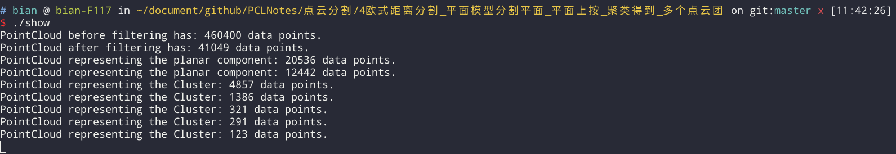
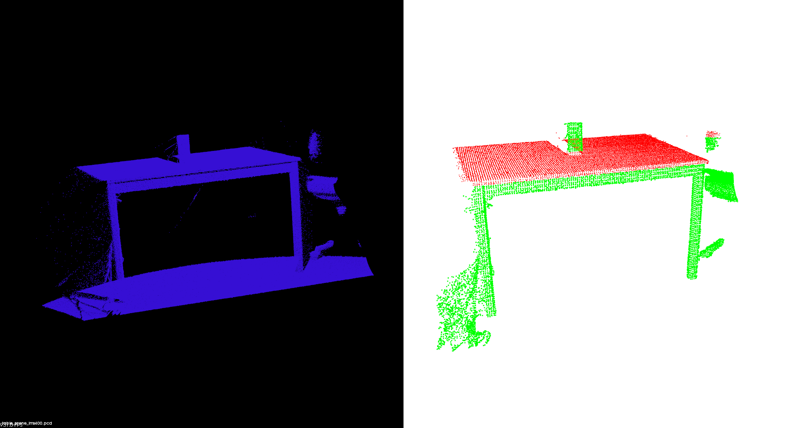

# 欧氏距离分割 平面模型分割平面　
# 平面上按　聚类得到　多个点云团

具体的实现方法大致是（原理是将一个点云团聚合成一类）：
    1. 找到空间中某点p10，用kdTree找到离他最近的n个点，判断这n个点到p10的距离。
	将距离小于阈值r的点p12,p13,p14....放在类Q里
    2. 在 Q\p10 里找到一点p12,重复1
    3. 在 Q\p10,p12 找到一点，重复1，找到p22,p23,p24....全部放进Q里
    4. 当 Q 再也不能有新点加入了，则完成搜索了
 
因为点云总是连成片的，很少有什么东西会浮在空中来区分。
但是如果结合此算法可以应用很多东东。
 
   1. 半径滤波(统计学滤波)删除离群点　体素格下采样等
   2. 采样一致找到桌面（平面）或者除去滤波
   3. 提取除去平面内点的　外点　（桌上的物体就自然成了一个个的浮空点云团）
   4. 欧式聚类　提取出我们想要识别的东西

 
 

