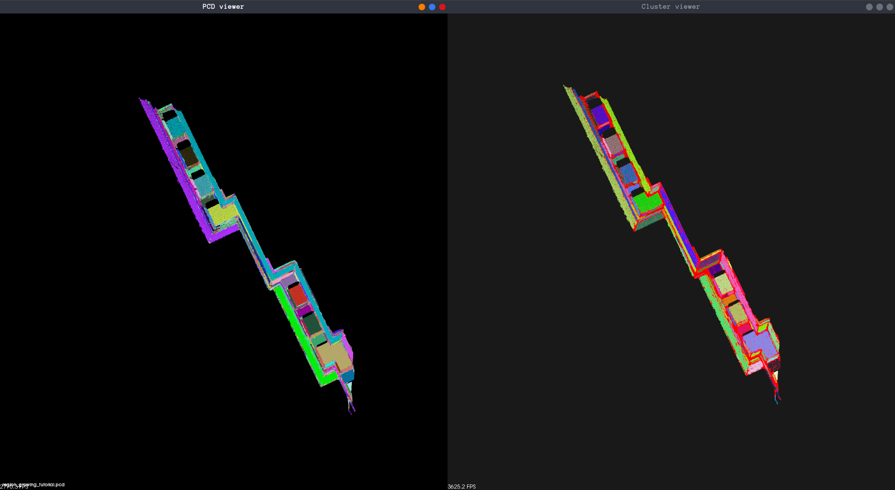

 

# pcl::RegionGrowing

区域生成的分割法
区域生长的基本思想是：将具有相似性的像素集合起来构成区域。
首先对每个需要分割的区域找出一个种子像素作为生长的起点，
然后将种子像素周围邻域中与种子有相同或相似性质的像素 
（根据事先确定的生长或相似准则来确定）合并到种子像素所在的区域中。
而新的像素继续作为种子向四周生长，
直到再没有满足条件的像素可以包括进来，一个区 域就生长而成了。
 
区域生长算法直观感觉上和欧几里德算法相差不大，
都是从一个点出发，最终占领整个被分割区域，
欧几里德算法是通过距离远近，
对于普通点云的区域生长，其可由法线、曲率估计算法获得其法线和曲率值。
通过法线和曲率来判断某点是否属于该类。

# 算法的主要思想

	首先依据点的曲率值对点进行排序，之所以排序是因为，
	区域生长算法是从曲率最小的点开始生长的，这个点就是初始种子点，
	初始种子点所在的区域即为最平滑的区域，
	从最平滑的区域开始生长可减少分割片段的总数，提高效率，
	设置一空的种子点序列和空的聚类区域，选好初始种子后，
	将其加入到种子点序列中，并搜索邻域点，
	对每一个邻域点，比较邻域点的法线与当前种子点的法线之间的夹角，
	小于平滑阀值的将当前点加入到当前区域，
	然后检测每一个邻域点的曲率值，小于曲率阀值的加入到种子点序列中，
	删除当前的种子点，循环执行以上步骤，直到种子序列为空.

# 其算法可以总结为

    0. 计算 法线normal 和 曲率curvatures，依据曲率升序排序；
    1. 选择曲率最低的为初始种子点，种子周围的临近点和种子点云相比较；
    2. 法线的方向是否足够相近（法线夹角足够 r p y），法线夹角阈值；
    3. 曲率是否足够小(　表面处在同一个弯曲程度　)，区域差值阈值；
    4. 如果满足2，3则该点可用做种子点;
    5. 如果只满足2，则归类而不做种;
    从某个种子出发，其“子种子”不再出现，则一类聚集完成
    类的规模既不能太大也不能太小.
 
 
显然，上述算法是针对小曲率变化面设计的。
尤其适合对连续阶梯平面进行分割：比如SLAM算法所获得的建筑走廊。

