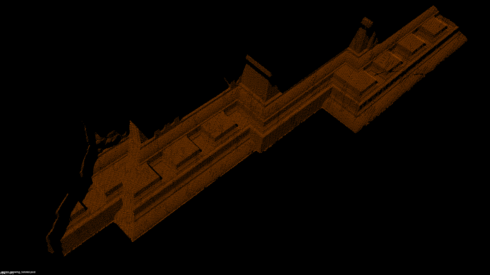
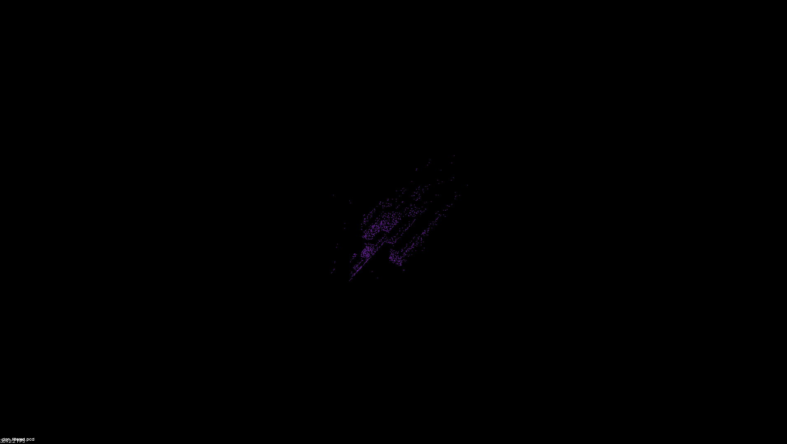
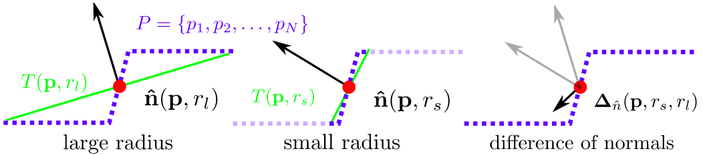

./show ../../datas/region_growing_tutorial.pcd 5 10 0.3 10 1 0

# pcl::DifferenceOfNormalsEstimation

类 pcl::DifferenceOfNormalsEstimation提供了一种根据不同尺度下法向量特征的差异性的点云分割方法，即DoN（[Difference of Normals](http://pointclouds.org/documentation/tutorials/don_segmentation.php#id7)）算法

# 点云的频率

​		点云和图像一样，有可能也存在频率的概念。但这个概念并未在文献中出现也未被使用，谨在本博文中滥用一下“高频”一词。点云表达的是三维空间中的一种信息，这种信息本身并没有一一对应的函数值。故点云本身并没有在讲诉一种变化的信号。但在抽象意义上，点云必然是在表达某种信号的，虽然没有明确的时间关系，但应该会存在某种空间关系（例如LiDar点云）。我们可以人为的指定点云空间中的一个点（例如Scan的重心或LiDar的“源”），基于此点来讨论点云在各个方向上所谓的频率。

　　在传统的信号处理中，高频信号一般指信号变化快，低频信号一般指信号变化缓慢。在图像处理中，高低频的概念被引申至不同方向上图像灰度的变化，傅里叶变换可以用于提取图像的周期成分滤除布纹噪声。在点云处理中，定义：点云法线向量差为点云所表达的信号。换言之，如果某处点云曲率大，则点云表达的是一个变化的信号。如果点云曲率小，则其表达的是一个不变的信号。这和我们的直观感受也是相近的，地面曲率小，它表达的信息量也小；人的五官部分曲率大，其表达了整个Scan中最大的信息量。

# 基于点云频率的滤波方法

​		虽然点云频率之前并没有被讨论，但使用频率信息的思想已经被广泛的应用在了各个方面，最著名的莫过于DoN算法。DoN算法被作者归类于点云分割算法中，但我认为并不准确，本质上DoN只是一种前处理，应该算是一种比较先进的点云滤波算法。分割本质上还是由欧式分割算法完成的。DoN 是 Difference of Normal 的简写。算法的目的是在去除点云低频滤波，低频信息（例如建筑物墙面，地面）往往会对分割产生干扰，高频信息（例如建筑物窗框，路面障碍锥）往往尺度上很小，直接采用 基于临近信息 的滤波器会将此类信息合并至墙面或路面中。所以DoN算法利用了多尺度空间的思想，算法如下：

1. 在小尺度上计算点云法线1
2. 在大尺度上计算点云法线2
3. 法线1-法线2
4. 滤去3中值较小的点
5. 欧式分割

　　显然，在小尺度上是可以对高频信息进行检测的，此算法可以很好的小尺度高频信息。其在大规模点云（如LiDar点云）中优势尤其明显。

# PCL对该算法的实现

　　算法运行过程可用图表示为：

https://www.cnblogs.com/ironstark/p/5010771.html

------

------

# DoN算法

DoN特征源于观察到基于所给半径估计的表面法向量可以反映曲面的内在几何特征，因此这种分割算法是**基于法线估计的**，**需要计算点云中某一点的法线估计**。而通常在**计算法线估计的时候都会用到邻域信息**，很明显**邻域大小的选取会影响法线估计的结果**。而在DoN算法中，邻域选择的大小就被称为support radius（支持半径）。对点云中某一点选取不同的支持半径，即可以得到不同的法线估计，而法线之间的差异，就是是所说的法线差异（Difference of Normals）。

支撑半径对输入点云估计的表面法线的影响见下图：

对于点云中的每个点，估计两个单位点法线具有不同的半径，. 这些点法线的归一化（向量）差异定义了算子。

DoN特征算子定义如下：

# 分割步骤：

1. 对于输入点云数据中的每一点，利用较大的支撑半径rl计算法向量；

2. 对于输入点云数据中的每一点，利用较大的支撑半径rs计算法向量；

3. 对于输入点云数据中的每一点，单位化每一点的法向量差异，计算公式如下

# 补充

基于不同领域半径估计的　法线的差异类分割点云

步骤：
 	1. 估计大领域半径$$ r_l $$下的法线    
 	2. 估计small领域半径$$ r_ｓ$$ 下的法线 
 	3. 法线的差异  $$det(n,r_l, r_s) = (n_l - n_s)/2$$
 	4. 条件滤波器 
 	5. 欧式聚类 法线的差异

流程说明：

1. 计算大小支撑半径；

2. 最对大小支撑半径进行点云法线估计；

3. 计算DoN特征向量；

4. 对曲率特征，进行条件滤波；

5. 基于欧式距离进行分割；

https://blog.csdn.net/zfjBIT/article/details/95188107
